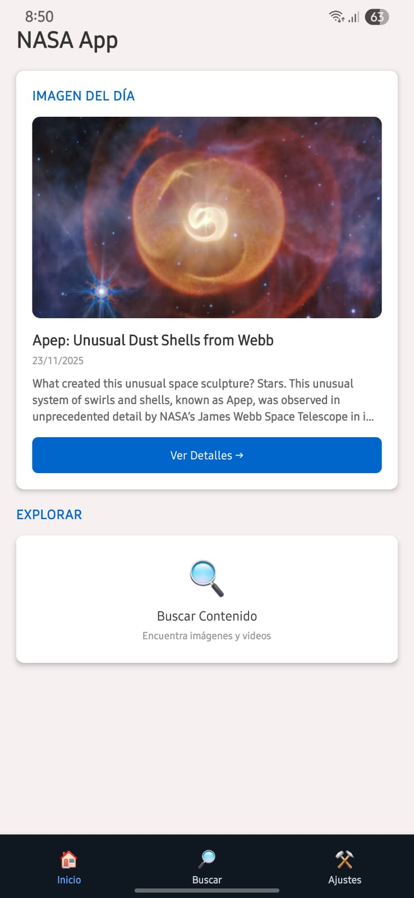
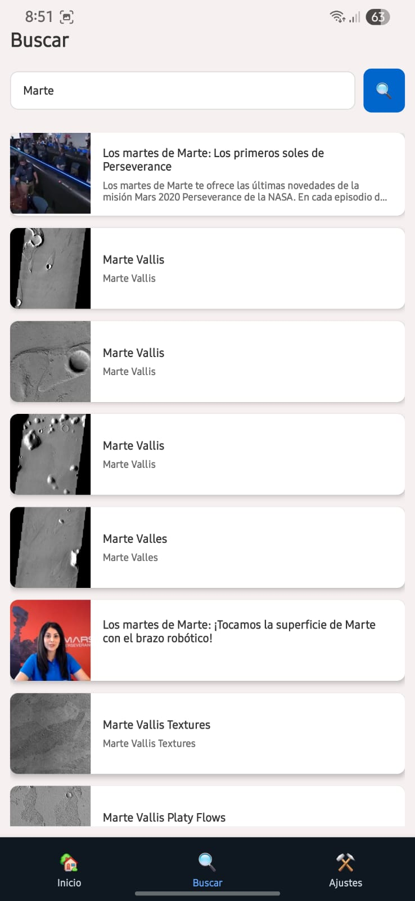
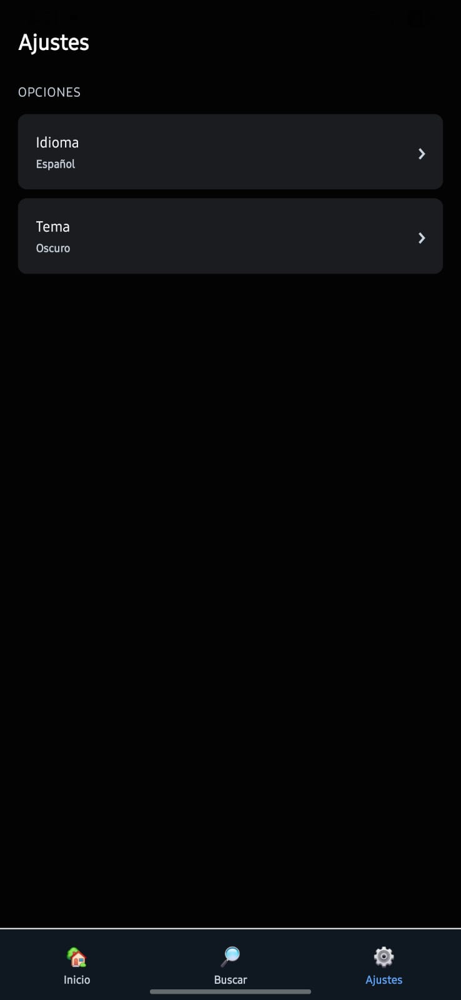
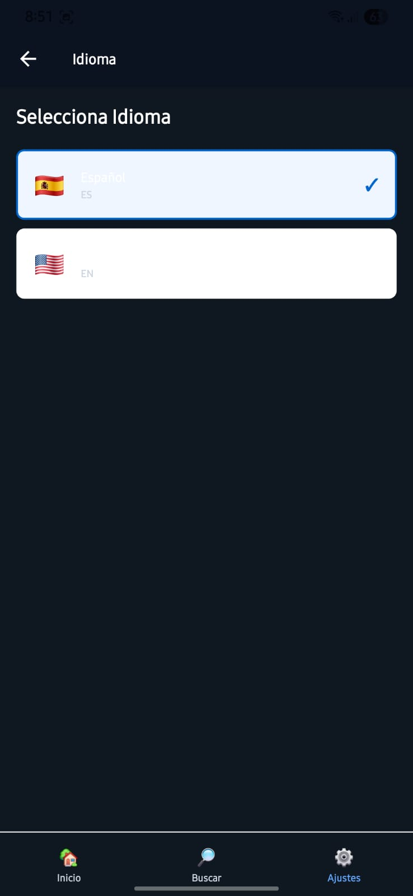
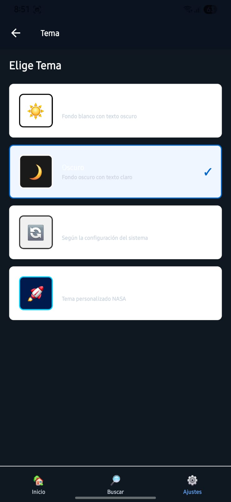

# 🚀 NASA App

Una aplicación móvil React Native que te permite explorar el fascinante universo de la NASA. Descubre la imagen astronómica del día, busca en el extenso archivo de imágenes y videos espaciales, y personaliza tu experiencia con múltiples temas e idiomas.

## ✨ Características

- **📸 Imagen del Día (APOD)**: Visualiza la imagen astronómica destacada por la NASA cada día con su descripción detallada
- **🔍 Búsqueda Avanzada**: Explora miles de imágenes y videos del archivo de la NASA
- **🌍 Multiidioma**: Soporte para Español e Inglés
- **🎨 Temas Personalizables**: 
  - Modo Claro
  - Modo Oscuro
  - Modo Automático
  - Tema NASA (personalizado)
- **💾 Almacenamiento Local**: Guarda tus preferencias y configuraciones
- **📱 Navegación Intuitiva**: Interfaz limpia y fácil de usar con navegación por pestañas

## 🛠️ Tecnologías

- **React Native**: Framework principal
- **TypeScript**: Para tipado estático
- **React Navigation**: Navegación entre pantallas
- **AsyncStorage**: Almacenamiento local
- **NASA API**: Fuente de datos oficial

## 📋 Requisitos Previos

- Node.js (v14 o superior)
- npm o yarn
- React Native CLI
- Xcode (para iOS) o Android Studio (para Android)
- Cuenta y API Key de NASA (gratuita)

## 🚀 Instalación

1. **Clonar el repositorio**
```bash
git clone https://github.com/angeldejesusbp2-cmd/NasaApp.git
cd NasaApp
```

2. **Instalar dependencias**
```bash
npm install
# o
yarn install
```

3. **Instalar dependencias de iOS** (solo macOS)
```bash
cd ios
pod install
cd ..
```

4. **Configurar API Key**

Abre `src/config/apiConfig.ts` y reemplaza la API Key con la tuya:
```typescript
export const NASA_API_KEY = 'TU_API_KEY_AQUI';
```

Obtén tu API Key gratis en: https://api.nasa.gov/

## ▶️ Ejecución

**iOS**
```bash
npm run ios
# o
yarn ios
```

**Android**
```bash
npm run android
# o
yarn android
```

## 📱 Estructura del Proyecto

```
src/
├── config/           # Configuración de la API
├── context/          # Context API para estado global
├── navigation/       # Configuración de navegación
├── screens/          # Pantallas de la aplicación
│   ├── HomeScreen.tsx
│   ├── SearchScreen.tsx
│   ├── DetailScreen.tsx
│   ├── SettingsScreen.tsx
│   ├── LanguageScreen.tsx
│   ├── ThemeScreen.tsx
│   ├── HelpScreen.tsx
│   └── OptionsScreen.tsx
├── services/         # Servicios de API y almacenamiento
│   ├── nasaAPI.ts
│   └── storageService.ts
└── utils/            # Utilidades y helpers
```

## 🎯 Funcionalidades Principales

### Pantalla de Inicio
- Muestra la Imagen Astronómica del Día
- Información detallada y descripción
- Acceso rápido a búsqueda

### Búsqueda
- Búsqueda en tiempo real en el archivo de NASA
- Resultados con miniaturas
- Vista detallada de cada elemento

### Configuración
- Cambio de idioma (ES/EN)
- Selección de tema visual
- Opciones de privacidad
- Gestión de caché

## 🌐 APIs Utilizadas

- **APOD (Astronomy Picture of the Day)**: Imagen del día
- **NASA Image and Video Library**: Búsqueda de contenido
- **Mars Rover Photos**: Fotos de rovers marcianos
- **EPIC**: Imágenes de la Tierra
- **Near Earth Objects**: Datos de asteroides

## 🔧 Configuración Avanzada

### Personalizar Timeout de API
Edita `src/config/apiConfig.ts`:
```typescript
export const API_CONFIG = {
  BASE_URL: 'https://api.nasa.gov',
  TIMEOUT: 30000, // milisegundos
};
```

### Agregar Más Idiomas
1. Edita `src/context/AppContext.tsx`
2. Agrega el idioma al tipo `Language`
3. Agrega las traducciones en el objeto `translations`

## 🐛 Problemas Conocidos

- Las imágenes de alta resolución pueden tardar en cargar
- Algunos videos requieren conexión estable
- La API de NASA tiene límite de solicitudes por hora

## Capturas de Pantalla de la Aplicación

### Logo de la Aplicación


### Inicio de la Aplicación


### Buscador de la Aplicación


### Ajustes de la Aplicación


### Idioma de la Aplicación


### Tema de la Aplicación



## 🤝 Contribuir

Las contribuciones son bienvenidas. Por favor:

1. Fork el proyecto
2. Crea una rama para tu feature (`git checkout -b feature/AmazingFeature`)
3. Commit tus cambios (`git commit -m 'Add some AmazingFeature'`)
4. Push a la rama (`git push origin feature/AmazingFeature`)
5. Abre un Pull Request

## 📄 Licencia

Este proyecto es de código abierto y está disponible bajo la Licencia MIT.

## 👥 Autor

**Angel de Jesus**
- GitHub: [@angeldejesusbp2-cmd](https://github.com/angeldejesusbp2-cmd)

## 🙏 Agradecimientos

- NASA por proporcionar APIs públicas gratuitas
- Comunidad de React Native
- Todos los colaboradores del proyecto

## 📞 Soporte

Si tienes problemas o preguntas:
- Abre un Issue en GitHub
- Email: support@nasaapp.com

## 🔄 Actualizaciones

### v1.0.0 (Actual)
- ✅ Imagen del día
- ✅ Búsqueda de contenido
- ✅ Múltiples idiomas
- ✅ Temas personalizables
- ✅ Almacenamiento local

### Próximas Versiones
- ⏳ Sistema de favoritos
- ⏳ Modo offline
- ⏳ Notificaciones
- ⏳ Compartir contenido
- ⏳ Descargar imágenes

---

⭐ Si te gusta este proyecto, no olvides darle una estrella en GitHub!